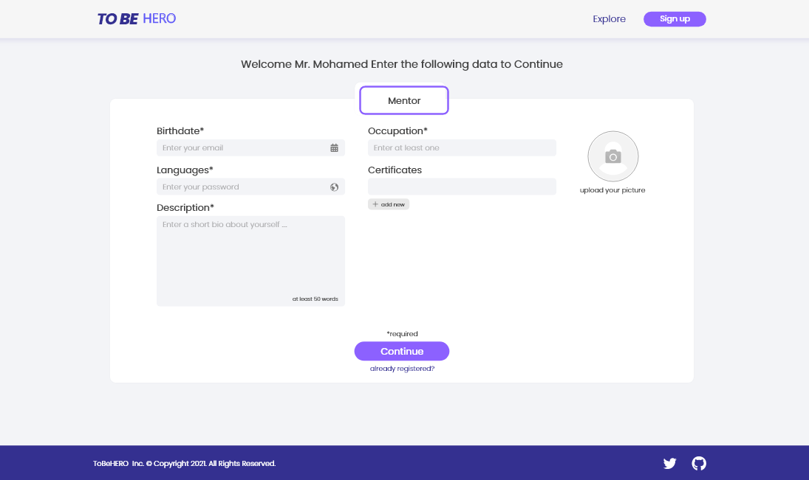
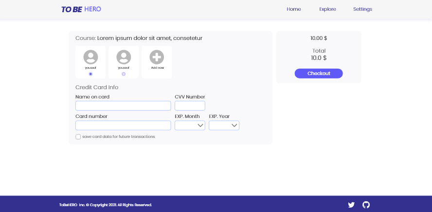

# toBeHero-Frontend

  
  

🉠We are a platform that assists guardians in finding mentors for their children for better education through one-on-one live video calls.
our project contains more than 20 screens, Here is a list of some screens:

## Table of contents

1. [Introduction](#introduction)
2. [Screens](#screens)
3. [Features](#Features)
4. [How to run ?](#Howtorun)
5. [Contributors](#Contributors)
   - [License](#License)

## ✨ Screens

  

  
  

## 💥 Features

- 📱 Mobile friendly
- 📸 Uploading photos
- 📺 Video call
- 🔐 Authentication and Authorization
- 💲Payment system with Stripe

## 🚀 How to run ?

- In the project directory, you can run: `npm install` to install the dependencies.
- `npm start` to run the app in the development mode at [http://localhost:3000](http://localhost:3000)  The page will reload if you make edits.  You will also see any lint errors in the console.
- `npm run build` Builds the app for production to the `build` folder. 
It correctly bundles React in production mode and optimizes the build for the best performance. The build is minified and the filenames include the hashes.  Your app is ready to be deployed!

## Contributors

<!-- ALL-CONTRIBUTORS-LIST:START - Do not remove or modify this section -->

<!-- prettier-ignore -->
<table id="Contributors">
  <tr>
    <td align="center">
    <a href="https://github.com/osamamammar"> <b>Osama Mohamed</b></a> 
    <a href="https://github.com/osamamammar" title="Code">💻</a>
    </td>
    <td align="center">
    <a href="https://github.com/mohammedsobhi"> <b>Mohamed Sobhi</b></a> <a href="https://github.com/mohammedsobhi" title="Code">💻</a>
    </td>
    <td align="center">
    <a href="https://github.com/imohammedramadan"> <b>Mohamed Ramadan</b></a> <a href="https://github.com/imohammedramadan" title="Code">💻</a>
    </td>
    
  </tr>
</table>
<!-- ALL-CONTRIBUTORS-LIST:END -->

### 📝 Copyright and License

Copyright © 2021 [ToBeHero](https://github.com/Unknown-squad).
This project is [Apache-2.0 License](https://github.com/Unknown-squad/toBeHero-frontend/blob/develop/LICENSE) licensed.

